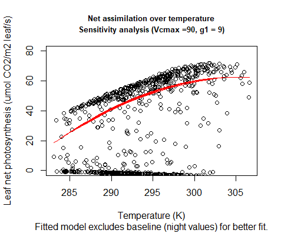

```{r setup, include=FALSE}
knitr::opts_chunk$set(echo = TRUE)
```

#### Term Paper in the Module Ecosystem-Atmosphere Processes
by Jonathan Gehret, Immo Shan & Lina Wernicke
// Date: 31.03.2021


## Introduction

The Earth’s ecosystems and the atmosphere are coupled in a network of physical, biological and chemical processes, forming a complex cycling of energy and substances - the “Earth system”. Terrestrial and aquatic ecosystems are part of it as well as the organisms inhabiting them, including the human population. Due to multiple interconnections between the Earth system’s components, human activities heavily impact the balance between them, causing global changes in climate, water and nutrient cycling, biodiversity and many more (IGBP, 2015).

The magnitude and pace of these human induced changes exceed the natural ranges of change in the Earth system and characterize a new era called the Anthropocene, ringed in by the industrial revolution in the late 18th century. Ever since, the world’s population is rising enormously and with it its consumption of resources and associated waste production. The rapid exploitation and combustion of fossil fuels which have built up over millions of years led to an unprecedented atmospheric concentration of carbon dioxide, methane and other greenhouse gases (IGBP, 2015). Another crucial factor of human impact is land use: As indicated by the Global Human Modification map, 95% of the Earth’s surface has been transformed to different extent by human activities (The Nature Conservancy, n.d.). Land cover change and the effects of fossil fuel combustion result in a feedback cascade between the Earth system’s components, creating challenges of new magnitude for human health. The altered atmosphere composition affects climate as well as plant productivity and thus, requires the adaptation of land uses like agriculture and forestry to sustain future yields.

To adapt to global change, the understanding of the processes between terrestrial ecosystems and the atmosphere is essential. Vegetation closely couples the biosphere with the atmosphere through the continuous exchange of carbon and water. About 30% of the carbon dioxide globally emitted by human activities is removed by the biosphere as well as about 40% of received rain is given back to the atmosphere through plant transpiration (Hawkins et al., 2020). Precipitation, temperature and atmospheric CO2 determine the distribution of vegetation across the Earth and vice versa vegetation types influence atmospheric CO2 concentration and climate through the reflection of radiation and the release of water vapor. Especially forests play an important role and have a major impact on carbon and water cycling, temperature regulation and the albedo of landscapes. Dependent on the type of forest ecosystem and its location, these impacts can mitigate or amplify human-induced climate change (Bonan, 2015, 13 ff.).

The main physiological mechanisms linking the fluxes of CO2, water and energy between atmosphere and vegetation are photosynthesis and stomatal conductance. These closely coupled processes determine the plant’s water-use efficiency by regulating the gas exchange between leaf and air and thereby balancing the loss of water vapor from transpiration against the intake of CO2 for assimilation in response to prevailing environmental conditions (Bonan, 2015, 241 ff.). Influencing factors are, in addition to CO2 concentration and water availability, incoming radiation, temperature as well as soil parameters - all these need to be considered in analyzing land-atmosphere relations.

A comprehension of the complex correlations between atmosphere and terrestrial ecosystems is difficult to establish through mere observations. To properly connect all involved components and display their interdependencies with each other, computer models are indispensable. Such models merge simulation approaches from meteorological, hydrological and ecological points of view, forming useful research tools to investigate the impacts of global change (Bonan, 2019, 1 ff.). To display how ecosystems will react to ongoing change, an extrapolation of known data is inappropriate because it cannot predict future responses under changed environmental conditions. More confidence in predictions is given in modelling approaches derived from ecological theory with explicit assumptions about causal mechanisms within a system. Their grounding on mathematical equations makes these process-based models easier to interpret compared to other modelling approaches - as long as included ecological processes are relevant and refer to appropriate spatial and temporal scales. But even then, confidence in predictions is limited due to uncertain scopes of global change (Cuddington et al., 2013). To evaluate the accuracy of model predictions, the simulation of ecosystem responses to past conditions can be harnessed: If the modelled simulations fit measured data - especially of extreme weather conditions like droughts or heat waves - the model is likely to be able to predict future scenarios as well (Hawkins et al., 2020).

This bottom-up modelling approach was applied within the module “Ecosystem-Atmosphere Processes” to simulate the fluxes of substances and energy between a forest ecosystem and the atmosphere. The model development followed the structure of Bonan (2019), split into five sub-models created by student groups for the sections of soil hydrology and temperature, soil carbon cycling, radiative transfer, leaf temperature and photosynthesis and stomatal conductance. The data to be fitted with the simulation origins from continuous measurements of a research site in the Hainich National Park in Thuringia, Germany. The measuring tower is located in an unmanaged old beech forest which is part of the largest coherent deciduous woodland in Germany. The beech (Fagus sylvatica) is a common species in natural forests of Central Europe and is the potential natural vegetation of wide parts of Germany (Nationalpark Hainich, n.d.). How the Hainich beech forest responds to certain environmental conditions might help to predict how the distribution area of Fagus sylvatica could shift in future or how much more resilient natural forests are compared to managed forest stands regarding climate change.

This term paper describes the development of the sub-model for the processes of photosynthesis and stomatal conductance for the Hainich site, including underlying theory and an evaluation and discussion of the results.


## Theory


The leaf photosynthesis model can essentially be divided into two interacting components which are modeled individually. These two components
are photosynthesis in the form of net assimilation and stomatal conductance as chemical flux in and out of the leaf. All theory, equations and
figures are obtained from Bonan (2019) **Chapter 11** and **12**. 

### Photosynthesis


Photosynthesis is calculated using the Farquhar-von Caemmerer-Bernacchi model (FvCB model) that mathematically describes the C3 photosynthesis
pathway. 
The foundation for the model is formulated as 

{width=30%}

To calculate carboxylation and oxygenation, the Michaelis Menten response functions are used which calculate carboxylation and oxygenation
from the maximum rates (**Vcmax/Vomax**), intercellular concentrations (**ci, oi**) and the michaelis menten constants (**Kc and Ko**). 

{width=25%}

{width=25%}

Since oxygenation leads to loss of carbon, an intercellular carbon concentration exists at which no CO2 is taken up. This 
concentration is called the CO2 compensation point and is calculated by 

{width=25%}

Furthermore assimilation is not only limited by the maximum rate of carboxylation but also by the rate at which Ribulose 1,5-bisphosphate
(**RuBP**) is regenerating. This depends on light absorption and the electron transport in the photosystems (**Jmax**) which is typically
termed product limited assimilation. 
These assimilation types can account for **Vo** if the CO2 compensation point is regarded and are calculated by 

{width=30%}

{width=20%}

The net assimilation according to the FvCB model therefore can be formulated as 

{width=30%}

which is the minimum assimilation out of both carboxylation-limited- (Rubisco limited) and product-limited assimilation.  
To account for different enzyme kinetics at varying temperatures, temperature acclimation has to be incorporated using the Arrhenius function
which is normalized to 25°C 

{width=40%}


This function can be used in its peaked form to adapt the various parameters of the model (such as Vcmax, Jmax, Kc, Ko, etc.) from 25°C
standard values to the appropriate growth temperature. 

{width=40%}

{width=40%}

The entropy term for the thermal breakdown of biochemical processes can be calculated from temperature by 

{width=30%}

{width=30%}


### Stomatal Conductance


To calculate intercellular CO2 concentration for photosynthesis it is necessary to know the conductance of the stomata. This can be understood from 

{width=50%}

In order for CO2 to diffuse into the cell, a concentration gradient from outside to inside the cell is required. This is a dependency which is
formulated in the photosynthetic diffusion equation

{width=40%}

which can be rearragend to

{width=20%}

Since this is a linear relationship between net assimilation and stomatal conductance, a slope can be calculated and a ratio of intercellular
to ambient CO2 concentration is used to calculate stomatal conductance if **ci** is known. The relationship between intercellular CO2
concentration, net assimilation and stomatal conductance can be rewritten to focus on the leaf surface which is done for the Ball Berry model
of stomata conductance. 

{width=20%}

This model focuses on leaf surface humidity and boundary layer CO2 concentration while aiming to satisfy the interaction between stomatal
conductance and net assimilation. This interaction can be mathematically described by solving a set of net assimilation two equations for
intercellular CO2 concentration. 
Net assimilation of CO2 is governed by the biochemical demand for CO2, the diffusive supply and a stomatal constraint function. 
The constraint function can be combined with the supply function 

{width=30%}

to yield the supply-constraint function

{width=40%}

The biochemical demand is calculated as follows, depending on the photosynthesis limiting factor. 

{width=30%}

To calculate **ci** dependent on a given leaf temperature, an iterative approach can be taken which uses an initial **ci** value and adapts
this value until it satisfies the biochemical demand function as well as the diffusive supply-constraint function. 
This approach is graphically described in the following figure and is also applied in the model. 
The calculation is repeated until the old and new **ci** values converge.

{width=50%}


## Model development
## Model results and evaluation

### Calibration

### Sensitivity analysis

The sensitivity analysis has been conducted with assumed central values of Vcmax = 60 and g1 = 9. These approximate values have been taken from Kattge et al. (2009). (Figure 2.1)
The model ran for a duration of 1 month (July 2018) and the values were decreased and increased by 25% and 50% respectively. The oscillations represent day and night cycles. To superficially understand the sensitivity of the model, the output was visually compared in each direction. 

{width=50%}{width=50%}
**Figure 2.1: net assimilation and stomatal conductance under central  values of Vcmax and g1**
#### Vcmax modification


If Vcmax is decreased, net assimilation responds stronger to changes than if Vcmax is increased. In comparison, net assimilation drops about 30% if Vcmax is decreased by 25% and increases by approximately 10% if Vcmax is increased by 25%. (Figure 2.2)


{width=50%}{width=50%}
{width=50%}{width=50%}
**Figure 2.2: Net assimilation response to sensitivity analysis (Vcmax modification)**


The same behavior applies to the relative change in stomatal conductance when Vcmax is modified. The model is more sensitive to a decrease than to an increase in Vcmax. (Figure 2.3)


{width=50%}{width=50%}
{width=50%}{width=50%}

**Figure 2.3: Stomata conductance response to sensitivity analysis (Vcmax modification)**


The model responds to  increasing Vcmax with a shift of the photosynthesis temperature optimum. The temperature optimum increases about 7 K from -50% Vcmax to +50% Vcmax. (Figure 2.4)

{width=50%}{width=50%}
{width=50%}{width=50%}

**Figure 2.4: Temperature response to sensitivity analysis (Vcmax modification)**


#### g1 modification

If g1 is modified, a change of 25% weakly changes net assimilation into either direction respectively.
A 50% change of g1 does not change much if g1 is increased but a decrease causes a strong decrease in net assimilation. 
The model therefore is more sensitive to strong decreases in g1 than to other changes. (Figure 2.5)


{width=50%}{width=50%}
{width=50%}{width=50%}

**Figure 2.5: Net assimilation response to sensitivity analysis (g1 modification)**

Stomatal conductance increases and decreases proportionally with given changes to g1 and is not particularly sensitive to changes in either direction. (Figure 2.6)


{width=50%}{width=50%}
{width=50%}{width=50%}

**Figure 2.6: Stomata conductance response to sensitivity analysis (g1 modification)**


Net assimilation responds to temperature under g1 modification with a shift in temperature optimum relative to increasing g1. The temperature optima of the different g1 scenarios coves a slightly larger range than the optima of the Vcmax modification. (Figure 2.7 & 2.4)


{width=50%}{width=50%}
{width=50%}{width=50%}

**Figure 2.7: Temperature response to sensitivity analysis (g1 modification)**


### Modeled vs. observed data

#### Comparison
To compare modeled and observed data, the model was run over one year with 2018 climate data from the Hainich Forest.
The first obvious difference is that the modeled photosynthesis is much higher than the observed data with a maximum value of 62.2 umol CO2/m2 leaf/s while observed GPP peaks at 40.6 umol CO2/m2 leaf/s. Furthermore the modeled photosynthesis commences after roughly 100 days with no respiration before Day 100 and after Day 300. Observed GPP increases and decreases around similar times of the year but shows activity in winter as well. (Figure 3.1)

{width=50%}{width=50%}
**Figure 3.1: Modeled photosynthesis vs. observed photosynthesis**

#### Stomatal conductance

Modeled stomatal conductance shows a similar trend as modeled photosynthesis with no activity until ~ Day 100 and stp of activity at Day 300. (Figure 3.2)

{width=50%}
**Figure 3.2: Modeled stomatal conductance over one year**

#### Temperature response

The temperature optimum of modeled photosynthesis lies at approximately 300 K (~27° C) (Figure 3.3)

{width=50%}
**Figure 3.3: Temperature dependence of modeled photosynthesis**


## Discussion

### Calibration

### Sensitivity analysis

The sensitivity analysises show a general trend of the model being more sensitive if Vcmax and g1 are decreased compared to when they are increased. This may be due to the limiting effect that Vcmax has on the model with carboxylation being arguably a strongly limiting factor of photosynthesis, the model is harshly regulated by a decrease. If Vcmax is increased, the model may be limited by different factors, which cause the net assimilation to not reach the full potential of Vcmax. Limiting factors could be light, water potential or nutritive supply (which is not considered in this model). 
The temperature response of net assimilation to increasing Vcmax can be explained by the lower activation energy for carboxylation if temperature is increased further (Benomar et al., 2019). This interaction can be understood by the temperature dependence of the entropy term in the peaked arrhenius function (Theory, Equation 1.11 & 1.12).


### Modeled vs. Observed

When comparing modeled and observed data, the photosynthesis for the most part of the year is perfectly zero. Due to missing foiliage, a missing assimilation is quite possible, however zero activity for net assimilation is not realistic since respiration is not accounted for. Therefor, during winter, a negative net assimilation would be more plausible. 
After inspecting the input climate data for missing or implausible values, it is clear that the problem does not lie within that input data. It therefor can be either a potential error in the radiation input or an erroneous condition in the model which causes net assimilation to be completely zero. 
Regarding the strong difference in the amplitude of the model compared to the observed assimilation, we can refer to the difficulties in the calibration process which would lower Vcmax and g1 to unrealisticly low values. If realistic values were applied, unrealistic results were given. We suspect a problem within the model, concerning an overexaggerated conversion factor.


### Problems during transcription 


### Conclusion


## References


## Appendix


### Plotmaker making of

To have a uniform and simple way of producing plots, we designed a plotmaker
function which allowed us to feed in the output data of the model. The plotmaker then ran a few linear and nonlinear models to better understand the trend of the data. Since nighttime values  create a baseline of subzero values, we decided to exclude these values from the regressions to avoid a distortion of the model.

```{r plotmaker models, eval = FALSE}
#### Linear models ####

d.mod = data.frame(out, Sitedata) #creating a linear model data frame

d.mod.norm.an = subset(d.mod[which(d.mod$an > 0),])#only taking values >0
d.mod.norm.an$tair2 = d.mod.norm.an$tair^2
qmtemp_an = lm(d.mod.norm.an$an ~ d.mod.norm.an$tair + d.mod.norm.an$tair2 )

d.mod.norm.gs = subset(d.mod[which(d.mod$gs > 0.1),])#only taking values >0.1
d.mod.norm.gs$tair2 = d.mod.norm.gs$tair^2
qmtemp_gs = lm(d.mod.norm.gs$gs ~ d.mod.norm.gs$tair + d.mod.norm.gs$tair2 )

qmsw_an = nls(out$an~a*Sitedata$sw_in/(1+b*Sitedata$sw_in),data=c(out, Sitedata),start=list(a=1.8,b=0.04))

temp_an_predict = predict(qmtemp_an)
temp_gs_predict = predict(qmtemp_gs)
sw_in_an_predict = predict(qmsw_an)
```


**Then the pdf is rendered by running different plot function consecutively and combining them into one file.** 

```{r plotmaker pdf, eval = FALSE}
S = "Subtitle"
pdf (file= "Filepath")

plot(out$an ~ c(1:length(out$an)), xlab = "Timesteps in 30 min", ylab = "Leaf net photosynthesis (umol CO2/m2 leaf/s)", main= c("Net assimilation over time", S), type = "l", cex.main= 0.8, ylim = c(0,80))
plot(out$gs ~ c(1:length(out$an)), xlab = "Timesteps in 30 min", ylab = "Leaf stomatal conductance (mol H2O/m2 leaf/s)", main= c("stomata conductance over time", S), type = "l", cex.main= 0.8, ylim =c(0,1.8))

plot(out$an ~ Sitedata$tair, xlab = "Temperature (K)", ylab = "Leaf net photosynthesis (umol CO2/m2 leaf/s)", main = c("Net assimilation over temperature", S), sub = "Fitted model excludes baseline (night values) for better fit.", cex.main= 0.8, ylim = c(0,80))
lines(temp_an_predict ~ d.mod.norm.an$tair, col = "red")

plot(out$gs ~ Sitedata$tair, xlab = "Temperature (K)", ylab = "Leaf stomatal conductance (mol H2O/m2 leaf/s)", main =c("stomata conductance over temperature", S), sub = "Fitted model excludes baseline (night values) for better fit.", cex.main= 0.8, ylim = c(0, 1.8))
lines(temp_gs_predict ~ d.mod.norm.gs$tair, col = "red")

plot(out$an ~ Sitedata$sw_in, xlab = "Incoming shortwave radiation (W/m2)", ylab ="Leaf net photosynthesis (umol CO2/m2 leaf/s)", main = c("Net assimilation over shortwave radiation", S), cex.main= 0.8, ylim = c(0,80))
lines(sw_in_an_predict ~ Sitedata$sw_in, col="red")
dev.off()

```

