```{r setup, include=FALSE}
knitr::opts_chunk$set(echo = TRUE)
```

## 1. Introduction

The Earth’s ecosystems and the atmosphere are coupled in a network of physical, biological and chemical processes, forming a complex cycling of energy and substances - the “Earth system”. Terrestrial and aquatic ecosystems are part of it as well as the organisms inhabiting them, including the human population. Due to multiple interconnections between the Earth system’s components, human activities heavily impact the balance between them, causing global changes in climate, water and nutrient cycling, biodiversity and many more (IGBP, 2015).

The magnitude and pace of these human induced changes exceed the natural ranges of change in the Earth system and characterize a new era called the Anthropocene, ringed in by the industrial revolution in the late 18th century. Ever since, the world’s population is rising enormously and with it its consumption of resources and associated waste production. The rapid exploitation and combustion of fossil fuels which have built up over millions of years led to an unprecedented atmospheric concentration of carbon dioxide, methane and other greenhouse gases (IGBP, 2015). Another crucial factor of human impact is land use: As indicated by the Global Human Modification map, 95% of the Earth’s surface has been transformed to different extent by human activities (The Nature Conservancy, n.d.). Land cover change and the effects of fossil fuel combustion result in a feedback cascade between the Earth system’s components, creating challenges of new magnitude for human health. The altered atmosphere composition affects climate as well as plant productivity and thus, requires the adaptation of land uses like agriculture and forestry to sustain future yields.

To adapt to global change, the understanding of the processes between terrestrial ecosystems and the atmosphere is essential. Vegetation closely couples the biosphere with the atmosphere through the continuous exchange of carbon and water. About 30% of the carbon dioxide globally emitted by human activities is removed by the biosphere as well as about 40% of received rain is given back to the atmosphere through plant transpiration (Hawkins et al., 2020). Precipitation, temperature and atmospheric CO2 determine the distribution of vegetation across the Earth and vice versa vegetation types influence atmospheric CO2 concentration and climate through the reflection of radiation and the release of water vapor. Especially forests play an important role and have a major impact on carbon and water cycling, temperature regulation and the albedo of landscapes. Dependent on the type of forest ecosystem and its location, these impacts can mitigate or amplify human-induced climate change (Bonan, 2015, 13 ff.).

The main physiological mechanisms linking the fluxes of CO2, water and energy between atmosphere and vegetation are photosynthesis and stomatal conductance. These closely coupled processes determine the plant’s water-use efficiency by regulating the gas exchange between leaf and air and thereby balancing the loss of water vapor from transpiration against the intake of CO2 for assimilation in response to prevailing environmental conditions (Bonan, 2015, 241 ff.). Influencing factors are, in addition to CO2 concentration and water availability, incoming radiation, temperature as well as soil parameters - all these need to be considered in analyzing land-atmosphere relations.

A comprehension of the complex correlations between atmosphere and terrestrial ecosystems is difficult to establish through mere observations. To properly connect all involved components and display their interdependencies with each other, computer models are indispensable. Such models merge simulation approaches from meteorological, hydrological and ecological points of view, forming useful research tools to investigate the impacts of global change (Bonan, 2019, 1 ff.). To display how ecosystems will react to ongoing change, an extrapolation of known data is inappropriate because it cannot predict future responses under changed environmental conditions. More confidence in predictions is given in modelling approaches derived from ecological theory with explicit assumptions about causal mechanisms within a system. Their grounding on mathematical equations makes these process-based models easier to interpret compared to other modelling approaches - as long as included ecological processes are relevant and refer to appropriate spatial and temporal scales. But even then, confidence in predictions is limited due to uncertain scopes of global change (Cuddington et al., 2013). To evaluate the accuracy of model predictions, the simulation of ecosystem responses to past conditions can be harnessed: If the modelled simulations fit measured data - especially of extreme weather conditions like droughts or heat waves - the model is likely to be able to predict future scenarios as well (Hawkins et al., 2020).

This bottom-up modelling approach was applied within the module “Ecosystem-Atmosphere Processes” to simulate the fluxes of substances and energy between a forest ecosystem and the atmosphere. The model development followed the structure of Bonan (2019), split into five sub-models created by student groups for the sections of soil hydrology and temperature, soil carbon cycling, radiative transfer, leaf temperature and photosynthesis and stomatal conductance. The data to be fitted with the simulation origins from continuous measurements of a research site in the Hainich National Park in Thuringia, Germany. The measuring tower is located in an unmanaged old beech forest which is part of the largest coherent deciduous woodland in Germany. The beech (Fagus sylvatica) is a common species in natural forests of Central Europe and is the potential natural vegetation of wide parts of Germany (Nationalpark Hainich, n.d.). How the Hainich beech forest responds to certain environmental conditions might help to predict how the distribution area of Fagus sylvatica could shift in future or how much more resilient natural forests are compared to managed forest stands regarding climate change.

This term paper describes the development of the sub-model for the processes of photosynthesis and stomatal conductance for the Hainich site, including underlying theory and an evaluation and discussion of the results.


## 2. Theory


The leaf photosynthesis model can essentially be divided into two interacting components which are modeled individually. 
These two components are photosynthesis in the form of net assimilation and stomatal conductance as chemical flux in and out of the leaf. The following theoretical explanations attempt to outline the calculations and relationships that were applied in the photosynthesis model.
All theory, equations and figures are obtained from Bonan (2019) **Chapter 11** and **12**. 

### 2.1 Photosynthesis


Photosynthesis is calculated using the Farquhar-von Caemmerer-Bernacchi model (FvCB model) that mathematically describes the C3 photosynthesis
pathway. 
The foundation for the model is formulated as 

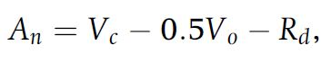{width=30%}

To calculate carboxylation and oxygenation, the Michaelis Menten response functions are used which calculate carboxylation and oxygenation
from the maximum rates (**Vcmax/Vomax**), intercellular concentrations (**ci, oi**) and the michaelis menten constants (**Kc and Ko**). 

{width=25%}

{width=25%}

Since oxygenation leads to loss of carbon, an intercellular carbon concentration exists at which no CO2 is taken up. This 
concentration is called the CO2 compensation point and is calculated by 

{width=25%}

Furthermore assimilation is not only limited by the maximum rate of carboxylation but also by the rate at which Ribulose 1,5-bisphosphate
(**RuBP**) is regenerating. This depends on light absorption and the electron transport in the photosystems (**Jmax**) which is typically
termed product limited assimilation. 
These assimilation types can account for **Vo** if the CO2 compensation point is regarded and are calculated by 

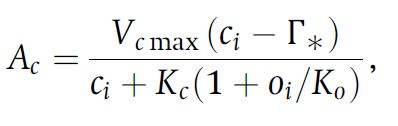{width=30%}

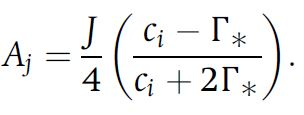{width=20%}

The net assimilation according to the FvCB model therefore can be formulated as 

{width=30%}

which is the minimum assimilation out of both carboxylation-limited- (Rubisco limited) and product-limited assimilation.  
To account for different enzyme kinetics at varying temperatures, temperature acclimation has to be incorporated using the Arrhenius function
which is normalized to 25°C 

{width=40%}


This function can be used in its peaked form to adapt the various parameters of the model (such as Vcmax, Jmax, Kc, Ko, etc.) from 25°C
standard values to the appropriate growth temperature. 

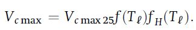{width=40%}

{width=40%}

The entropy term for the thermal breakdown of biochemical processes can be calculated from temperature by 

{width=30%}

{width=30%}


### 2.2 Stomatal Conductance


To calculate intercellular CO2 concentration for photosynthesis it is necessary to know the conductance of the stomata. This can be understood from 

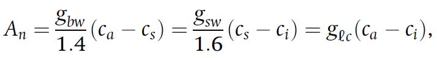{width=50%}

In order for CO2 to diffuse into the cell, a concentration gradient from outside to inside the cell is required. This is a dependency which is
formulated in the photosynthetic diffusion equation

{width=40%}

which can be rearragend to

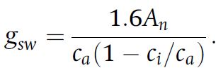{width=20%}

Since this is a linear relationship between net assimilation and stomatal conductance, a slope can be calculated and a ratio of intercellular
to ambient CO2 concentration is used to calculate stomatal conductance if **ci** is known. The relationship between intercellular CO2
concentration, net assimilation and stomatal conductance can be rewritten to focus on the leaf surface which is done for the Ball Berry model
of stomata conductance. 

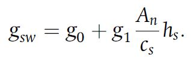{width=20%}

This model focuses on leaf surface humidity and boundary layer CO2 concentration while aiming to satisfy the interaction between stomatal
conductance and net assimilation. This interaction can be mathematically described by solving a set of net assimilation two equations for
intercellular CO2 concentration. 
Net assimilation of CO2 is governed by the biochemical demand for CO2, the diffusive supply and a stomatal constraint function. 
The constraint function can be combined with the supply function 

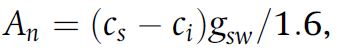{width=30%}

to yield the supply-constraint function

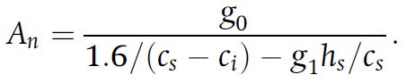{width=40%}

The biochemical demand is calculated as follows, depending on the photosynthesis limiting factor. 

{width=30%}

To calculate **ci** dependent on a given leaf temperature, an iterative approach can be taken which uses an initial **ci** value and adapts
this value until it satisfies the biochemical demand function as well as the diffusive supply-constraint function. 
This approach is graphically described in the following figure and is also applied in the model. 
The calculation is repeated until the old and new **ci** values converge. (Figure 1)

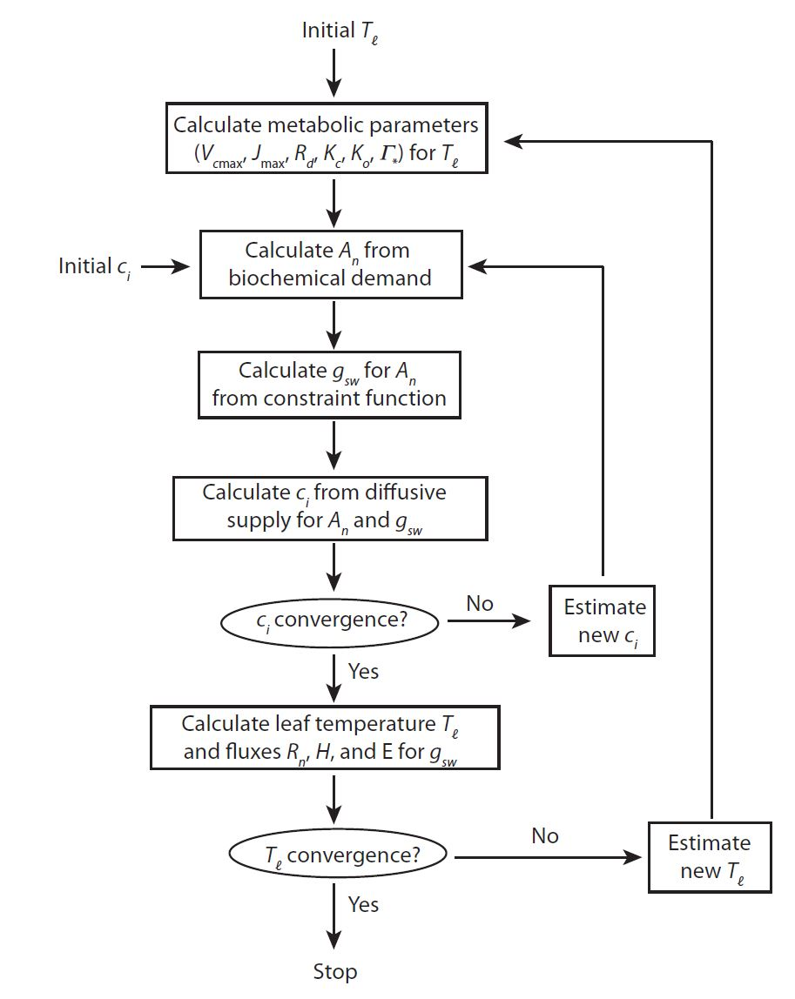{width=50%}


## 3. Model development

The code was created by translating the Matlab code for the photosynthesis and the stomatal conductance model from the Bonan (2019) book to R. The code was split over multiple scripts. The script included methods for C3 and C4 plants as well as for the three different stomatal conductance models Ball-Berry, Medlyn and water use efficiency optimization. As it was decided upon to create the model using Ball-Berry and only for C3 plants, the other options were left out.
The parameters variables that were carried in multiple lists, for example atmos, flux etc. were redistributed to the flux list for state and output variables, and added to parameters.csv for parameters. An overview of the occurring parameters and variables can be found in the list of tables.

### 3.1 Model Scripts

The main script is calc_fun_Photosynthesis_StomatalConductance.R. Here the main function that is being called in the main loop is defined. It includes calculation of vapor pressure and saturation vapor pressure by using the satvap.R script, which calculates saturation vapor pressure in dependence of temperature (Flatau et al., 1992). Also included in the main script is the assignment of CO2 and H2O boundary layer conductance, which are either received from the outside or calculated by use of the (CO2)LeafBoundaryLayer.R. It draws on temperature, pressure, leaf thickness among others. After the boundary layer part, photosynthetically active radiation is handed over to the flux list, which is created in the setup_Photosynthesis_StomatalConductance.R script, which was also used for loading the pracma library and changing the parameters for the sensitivity analysis. Then, further elements required for photosynthesis are prepared: scaling factors for high temperature inhibition, adjustment of the photosynthetic parameters for temperature and the  Michaelis-Menten-function (including respiration rd), plus the electron transport rate je for C3 plants. For managing inputs, such as radiation and leaf temperature from other groups and doing separate runs for sunny and shaded leaves of calc_fun_Photosynthesis_StomatlConductance in one script, fun_calc_an_gs was created. Here, in case the input isn’t available for radiation, leaf temperature and boundary layer conductances of H20 and CO2, default values are set instead. It takes met,state_last,pars,out[n,] as input objects, with met being the measured input data at current time step, state_last the state variables at last time step, pars the parameters specified in the beginning and out[n,] the output variables at the current time step so far, in this case radiation output. As the leaf temperature function is only called after the leaf photosynthesis function, even taking into account stomatal conductance gs, there is no leaf temperature available at current timestep. As a workaround, leaf temperature from the last timestep is used instead.

Before calling the function for rate of photosynthesis and stomatal conductance calculations, initial estimates for ci are set based on atmospheric CO2 concentration met$co2:

```{r, eval = FALSE}
ci0 = 0.7 * met$co2;
ci1 = ci0 * 0.99;
```

These initial values are given to hybrid_root_ci to iterate photosynthesis calculations until the change in ci is smaller than the chosen tolerance tol (compare ci convergence, figure 1). Hybrid_root_ci was adjusted from the hybrid_root matlab script, which was originally solving roots by the secant and Brent’s method for any given function and initial estimates, to only function for CiFunc.R, as knowledge of how to pass on a function to another function for evaluation in R was not available. As an alternative, brent_root_ci is called in the hybrid_root_ci, which also solves the root, and was rewritten analogously to hybrid_root_ci. As the full run of the model took some amount of time to complete, this brent_root_ci-backup could've optinally been left out.

In the aforementioned CiFunc.R ci, an and gs are calculated. This function is not directly called, but used by the root functions. In here, the core calculations are made:
First, Rubisco-limited photosynthesis ac and RuBP regeneration-limited photosynthesis aj are calculated by:

```{r, eval = FALSE}
flux$ac = flux$vcmax * max(ci_val - flux$cp, 0) / (ci_val + flux$kc * (1 + pars$o2air / flux$ko))
flux$aj = flux$je * max(ci_val - flux$cp, 0) / (4 * ci_val + 8 * flux$cp)
```

With vcmax being the maximum carboxylation rate, ci_val the respective ci value, cp the CO2 compensation point, kc and ko the Michaelis-Menten constant for CO2 and O2.

Then, gross photosynthesis rate an is found as the intermediate minimum of co-limited rate ai found by solving the polynomial 
```{r, eval = FALSE}
aquad*flux$ai^2 + bquad*flux$ai + cquad = 0,
```
where the smaller of the two roots is the correct solution. The code for the described situation looks as follows. Note that the used roots function from the package pracma returns a real and an imaginary part, so Re() only takes the real part from that.

```{r, eval = FALSE}
aquad = pars$colim_c3;
bquad = -(flux$ac + flux$aj);
cquad = flux$ac * flux$aj;
pcoeff = c(aquad,bquad,cquad);
proots = roots(pcoeff);
flux$ai = min(Re(proots[[1]]), Re(proots[[2]]));
flux$ag = flux$ai;
```

Growth photosynthesis is prevented from ever being negative by use of the max() function. Finally, net CO2 uptake an is calculated by subtracting the respiration r:

```{r, eval = FALSE}
flux$an = flux$ag - flux$rd;
```

Following the net photosynthesis rate, the Ball-Berry stomatal conductance was similarly calculated from solving the quadratic equation for gs given an: 
```{r, eval = FALSE}
aquad*gs^2 + bquad*gs + cquad = 0.
```
Here, the larger of the two roots is the correct solution. In case an is not greater than 0, gs is set to the minimum conductance g0:

```{r, eval = FALSE}
term = flux$an / flux$cs;
if (flux$an > 0){
  aquad = 1;
  bquad = flux$gbw - pars$g0 - pars$g1 * term;
  cquad = -1 * flux$gbw * (pars$g0 + pars$g1 * term * flux$eair / flux$esat);
  pcoeff = c(aquad,bquad,cquad);
  proots = roots(pcoeff);
  flux$gs = max(Re(proots[[1]]), Re(proots[[2]]));
} else {
  flux$gs = pars$g0;
}
```

Using these newly calculated an and gs values, ci is then found by including leaf boundary layer CO2 conductance and CO2 of:

```{r, eval = FALSE}
gleaf = 1 / (1 / flux$gbc + 1.6 / flux$gs);
cinew = met$co2 - flux$an / gleaf;
```

The difference between current and new ci is returned and tested by hybrid_root_ci:

```{r, eval = FALSE}
if (flux$an >= 0){ ci_dif = cinew - ci_val;} else { ci_dif = 0;}
```

If the values converge, flux with an, gs and ci is returned and the next time step is started.

### 3.2 Testing scripts

The photosynthesis_tests_loop.R, based on the main.R script, was used for testing runs over durations of days, the month of july and the year 2018 of the Hainich data. Timestep is 60 minutes, as has been decided upon. It includes the radiation group script. For including PAR for shaded and sunny leaves, the photosynthesis script is called two times, once for each case. The resulting values for sunny and the much bigger shaded an and gs are then combined by addition of flux. The LAI has been set to five by the radiation group. For radiation, output ic_sun and ic_sha are being used. These are multiplied by 2 as a means of transferring the units from Watt/m2 to umol photon/m2 ground/s rate. In this conversion, the units of per square meter leaf per second are changed to per ground area per second, while adjustments to only take into account the photosynthetically active part of the radiation are made. This script is not to be used in the final model, as the main.R contains the loop while also including the remaining model elements contributed by other groups.

During the translation and testing process, some additional scripts were used which are not relevant to the final model. These include: LeafPhyisologyParams which filled the “leaf” list with a number of important parameters which were instead added to parameters.csv manually. These include Vcmax at 25C, Ball-Berry minimum leaf conductance (mol H2O/m2/s) g0 and the Ball-Berry slope of conductance-photosynthesis relationship g1 with an initial value of 9 among others. Also included was leaf dimension. For testing this script was used, while for the final model the parameters were manually inserted into the parameters.csv file. LeafPhotosynthesis was a predecessor of calc_fun_Photosynthesis_StomatalConductance.R. sp_12_02.R is another parameter setup file with physical and atmospheric parameters, mostly manually added to parameters.csv, obsoleting this script. Photosynthesis_StomatalCoductence_Model.R included the loop, but was later incorporated into tests_loop and calc_fun. Plotmaker_ps_sc.R is being used as a helping tool for creating fitting plots with the model output.

Used for testing purposes was PAR.R, while the data from the radiation group was not available yet. This part was extracted from the sp_12_02 matlab script and also reduced to the minimum necessary components. It calculates PAR based on incoming shortwave radiation. A comparison of those values with those received from the group show they are in the same order of magnitude and correlate.

### 3.3 Model Merging

A Main.R with loop, along with setup and multiple other files to read in data and build the backbone of this model was supplied. Here, the call of the fun_calc_an_gs function was added, as well as of the setup_Photosynthesis_StomatalConductance. As the satvap.R script was also used by the group responsible for leaf photosynthesis, it was added to the Main.R so both groups would use it. In the loop, the ordering is set in a way that first the radiation script is calculated, from which the photosynthetically active radiation for the photosynthesis and stomatal conductance model is derived. These necessary values ic_sunlit and ic_sha are therefore taken from the “out” list at the current time step. As the leaf temperature script also requires the input of gs for more accurate calculation, it was placed after the stomatal conductance part. There leaf boundary layer conductances for water are calculated, on top of the name giving leaf temperature. As a compromise, instead of including the calculations in the iterative search for conversion for ci (Figure 1), these variables were instead taken from the last timestep via the state_last object. At each time step, the output variables are added to the “out” list. As mentioned before, all necessary parameters were added to parameters.csv.

### 3.4 Calibration 

The calibration was done over a time frame of one month, in this case the same month of July 2018 that general testing was undertaken for. For debugging the code different time spans of ten hours, one day or five days were also used occasionally. There was no available data for gs available to compare with, but for photosynthesis rate, GPP could be used. The residuals were created by comparing gross photosynthesis rate ag with the measured GPP values. As their respective units differ (GPP had been conversed from µmol m-2 s-1 to kg m-2 dt-1 before, a conversion factor from one to the other is used by factoring in 12 / 1000000 / 1000 * 3600.

The calibration was created based on the code that was already available by the soil hydrology group. For this purpose, the FME package’s modFit function was used to fit more accurate values for maximum rate of Rubisco carboxylase activity at 25°C vcmax25 and the slope of the an, gs relationship g1. The modified loop script fun_photosynthesis_calib.R and an optimization script fun_costphoto.R proved useful, comparing output photosynthesis values with measured GPP values. In photosynthesis_calib.R, the necessary package FME was loaded. Then, the to be tested parameters vcmax25 and g1 are set by : 

```{r, eval = FALSE}
pars_calib <- c(vcmax25 = 60 , g1 = 9);
pars_up <- c(vcmax25 = 80, g1 = 11);
pars_low <- c(vcmax25 = 40, g1 = 7);
```

starting value, upper and lower limits, the default values being vcmax25 around 60 and g1 around 9. Additionally the three complementary calibration scripts are sourced: first, setup_photoynthesis_calib.R is called by photosynthesis_calib.R, basically acting as an equivalent to the preparation part of the Main.R file, loading necessary functions, setting time step, loading parameters and site data. Secondly, fun_photosynthesis_calib.R, which loops over all timesteps for calibration purposes with the specified testing parameters. Similarly to the general purpose testing script, radiation is taken from the radiation group, as their code was already available when calibration was first initiated. It returns the calculated values which are then compared in fun_costphoto by being called by the FME’s modFit function:

```{r, eval = FALSE}
myfit <- modFit(f = cost_photo, p = pars_calib, lower = pars_low , upper = pars_up )
```

This was set to calibrate for the function cost_photo for the desired parameters as chosen beforehand. This function Cost_photo is defined in the fun_costphoto.R script and it calculates the output variable of the fun_photosynthesis_calib and compares the resulting residuals for gross photosynthesis ag with measured GPP values, adjusted for unit. For interpreting the results of the calibration, the coefficients were revealed by use of coef(myfit) and summary(myfit).

## 4. Model results and evaluation

### 4.1 Calibration

The runs of the calibration calculations were difficult, the code had to be adjusted several times. But even after some trying to find the problems, it never returned a realistic fit. The returned calibrated values for Vcmax25 and g1 always corresponded to the lower limits that have been set for the calculation. If these limits were removed, the returned values tend to be even lower: below 40 µmol m-2 s-1 for Vcmax25 and around 5 for g1. One example result for a run over 24 hours with unrealistic lower limits:

```{r, eval = FALSE}
Parameters:
 Estimate Std. Error t value            Pr(>|t|)
vcmax25  38.4429     2.3026   16.70 <0.0000000000000002 ***
  g1        5.7897     0.5405   10.71 <0.0000000000000002 ***
  ---
  Signif. codes:  0 ‘***’ 0.001 ‘**’ 0.01 ‘*’ 0.05 ‘.’ 0.1 ‘ ’ 1

Residual standard error: 3.925 on 742 degrees of freedom

Parameter correlation:
vcmax25     g1
vcmax25   1.000 -0.914
g1       -0.914  1.000
```

As an aside, a linear model was also fitted (in photosynthesis_tests_loop.R), using the Ball-Berry equation to calculate the slope g1 for any given model test run, returning values in between 8.5 and 8.8:

```{r, eval = FALSE}
gs_g0 = out$gs - pars$g0
an_hs_ca = (out$an * out$hs) / out$cs
plot(gs_g0 ~ an_hs_ca)
g1_lm = lm(gs_g0 ~ an_hs_ca)
coef(g1_lm)
```

With gs being stomatal conductance, g0 the minimum value for stomatal conductance, an the net photosynthesis rate, hs the humidity and cs the CO2 concentration at leaf surface.

### 4.2 Sensitivity analysis

The sensitivity analysis has been conducted with assumed central values of Vcmax = 60 and g1 = 9. These approximate values have been taken from Kattge et al. (2009). (Figure 4.2.1)
The model ran for a duration of 1 month (July 2018) and the values were decreased and increased by 25% and 50% respectively. The oscillations represent day and night cycles. To superficially understand the sensitivity of the model, the output was visually compared in each direction. 

{width=50%}{width=50%}
**Figure 4.2.1: net assimilation and stomatal conductance under central  values of Vcmax and g1**

#### Vcmax modification


If Vcmax is decreased, net assimilation responds stronger to changes than if Vcmax is increased. In comparison, net assimilation drops about 30% if Vcmax is decreased by 25% and increases by approximately 10% if Vcmax is increased by 25%. (Figure 4.2.2)


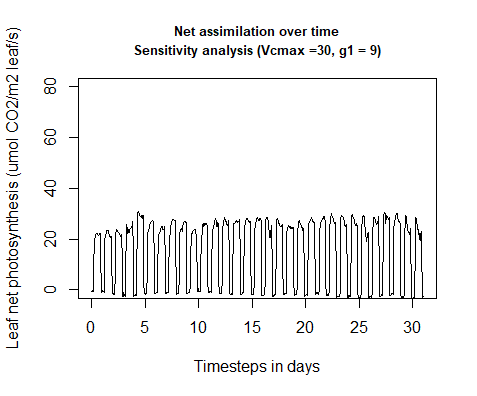{width=50%}{width=50%}
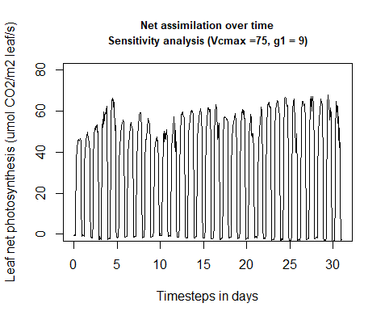{width=50%}{width=50%}
**Figure 4.2.2: Net assimilation response to sensitivity analysis (Vcmax modification)**


The same behavior applies to the relative change in stomatal conductance when Vcmax is modified. The model is more sensitive to a decrease than to an increase in Vcmax. (Figure 4.2.3)


{width=50%}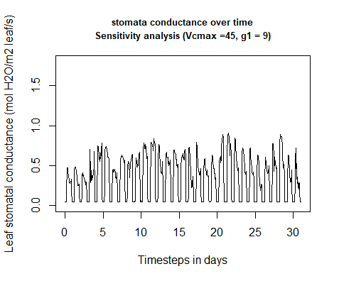{width=50%}
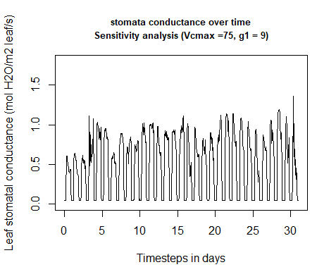{width=50%}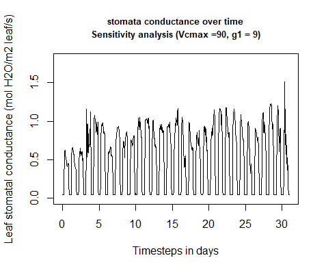{width=50%}

**Figure 4.2.3: Stomata conductance response to sensitivity analysis (Vcmax modification)**


The model responds to  increasing Vcmax with a shift of the photosynthesis temperature optimum. The temperature optimum increases about 7 K from -50% Vcmax to +50% Vcmax. (Figure 4.2.4)

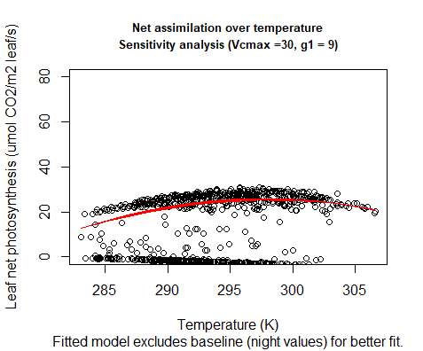{width=50%}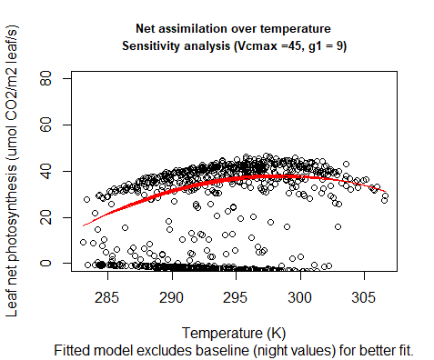{width=50%}
{width=50%}{width=50%}

**Figure 4.2.4: Temperature response to sensitivity analysis (Vcmax modification)**


#### g1 modification

If g1 is modified, a change of 25% weakly changes net assimilation into either direction respectively.
A 50% change of g1 does not change much if g1 is increased but a decrease causes a strong decrease in net assimilation. 
The model therefore is more sensitive to strong decreases in g1 than to other changes. (Figure 4.2.5)


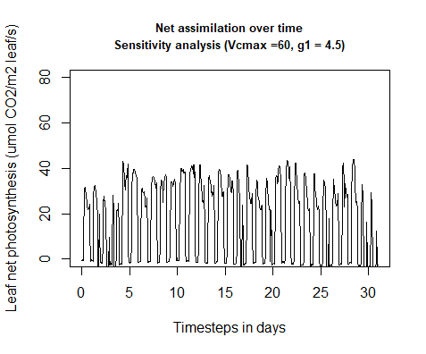{width=50%}{width=50%}
{width=50%}{width=50%}

**Figure 4.2.5: Net assimilation response to sensitivity analysis (g1 modification)**

Stomatal conductance increases and decreases proportionally with given changes to g1 and is not particularly sensitive to changes in either direction. (Figure 4.2.6)


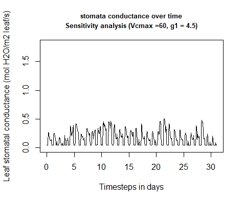{width=50%}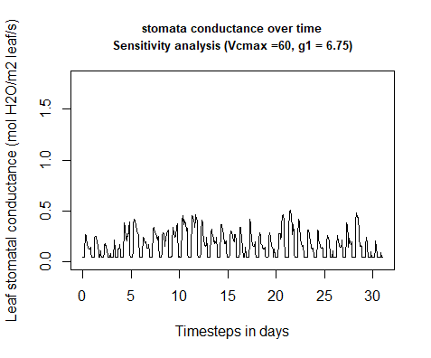{width=50%}
{width=50%}{width=50%}

**Figure 4.2.6: Stomata conductance response to sensitivity analysis (g1 modification)**


Net assimilation responds to temperature under g1 modification with a shift in temperature optimum relative to increasing g1. The temperature optima of the different g1 scenarios coves a slightly larger range than the optima of the Vcmax modification. (Figure 4.2.7 & 4.2.4)


{width=50%}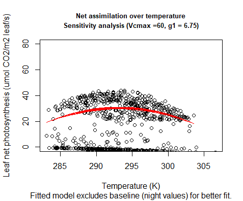{width=50%}
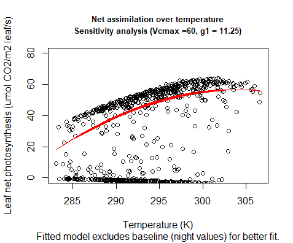{width=50%}{width=50%}

**Figure 4.2.7: Temperature response to sensitivity analysis (g1 modification)**


### 4.3 Modeled vs. observed data

#### Comparison
To compare modeled and observed data, the model was run over one year with 2018 climate data from the Hainich Forest.
The first obvious difference is that the modeled photosynthesis is much higher than the observed data with a maximum value of 62.2 umol CO2/m2 leaf/s while observed GPP peaks at 40.6 umol CO2/m2 leaf/s. Furthermore the modeled photosynthesis commences after roughly 100 days with no respiration before Day 100 and after Day 300. Observed GPP increases and decreases around similar times of the year but shows activity in winter as well. (Figure 4.3.1)

{width=50%}{width=50%}

**Figure 4.3.1: Modeled photosynthesis vs. observed photosynthesis**

#### Stomatal conductance

Modeled stomatal conductance shows a similar trend as modeled photosynthesis with no activity until ~ Day 100 and stp of activity at Day 300. (Figure 4.3.2)

{width=50%}

**Figure 4.3.2: Modeled stomatal conductance over one year**

#### Temperature response

The temperature optimum of modeled photosynthesis lies at approximately 300 K (~27° C) (Figure 4.3.3)

{width=50%}

**Figure 4.3.3: Temperature dependence of modeled photosynthesis**


## 5. Discussion

Creating a model means to simplify complex processes and generalize responses through mathematical equations. This detail reduction is necessary to emphasize essential components of a system and keep the simulation computable. The multitude of interconnections within a land-atmosphere system demands a balanced relation between simplification and complexity which depends on the model’s aim. To illustrate fluxes between forest and atmosphere, the used big-leaf model approach is sufficient (Bonan, 2019, 20 f.) though disregarding the forest-characteristic microclimate conditions that might distinguish the old beech forest of Hainich from that of managed forest stands.

Despite the generalization that comes with a canopy-model there is still enough complexity left to divide it into sub-models for the different sections. The challenges which occurred in the course of the development of the photosynthesis and stomatal conductance sub-model as well as the interpretation of obtained results are described in the following, according to the different working steps undertaken.


### 5.1 Problems during transcription 

The complexity of the interwoven physiological processes of plant assimilation was reflected in the code development in R. The code for the photosynthesis sub-model was divided into several scripts as it was as well in the reference code from Bonan (2019) that was written in Matlab. The code’s complexity made it partially challenging to keep track of the several interconnections and retain its functioning in spite of attempts to simplify it. This made debugging quite time-consuming and might be a general source for errors and uncertainty in the model functioning.

One difficulty that was faced while transcribing the code from Matlab to R was that R functions can only return one object. For example, two vectors have to be added to a container first if both are to be put out. As MatLab does not suffer this limitation, some of the functions to be transcribed did exactly that: returning two or more variables. For translation into R, those were added to lists which led to the value having to be accessed afterwards by use of double squared brackets [[]]. Another small difference in the two languages is the use of “.” instead of “\$” for accessing data formats. Therefore, for lists like “leaf” and the corresponding variables like “leaf.an”, the dot was replaced to form “leaf\$an”. Further, the “roots” function for solving polynomials in Matlab uses a reverse order compared to the equivalent “polyroots” function in R. One option would have been to switch the order of the input data, instead the “Pracma” package’s root function carrying the same function as the Matlab one was used.

### 5.2 Calibration

If the calibration ran successfully is questionable. The generated calibrated values for Vcmax25 and g1 did not seem to be properly fitted to the measured GPP values as they always were oriented at the lowest limits that have been set. For g1, which can even go as high up as 11 or more for Fagus (Medlyn et al., 2011), such low values seem highly unlikely. The main reason for this seems to be the general difference between observed GPP data and simulated net photosynthesis values (see Model results and evaluation, Figure 4.3.1). Even with potentially better fitting values for Vcmax25 and g1 it was not possible to align the trends of both assimilation measures.

This leads to the assumptions that either the model is flawed significantly in some of the points it takes into account, or there are variables not considered in the model which significantly impacted the real world values, for example human impact or low precipitation values not being taken into account properly by the model. One general difficulty for running a proper calibration was also the uncertainty about how to include and convert the radiation values that were provided to make the model output photosynthesis comparable to the measured GPP values. This may be the first place to look when trying to improve upon this model.

Fitting a linear model with the ball berry equation for g1 shows more realistic values close to 9, however these were not received by an iterative approach to find the optimal value but are based on the results of single model runs.

In the future, calibration could be undertaken for comparing gs values also, if they are available


### 5.3 Sensitivity analysis

The sensitivity analyses show a general trend of the model being more sensitive if Vcmax and g1 are decreased compared to when they are increased. This may be due to the limiting effect that Vcmax has on the model with carboxylation being arguably a strongly limiting factor of photosynthesis, the model is harshly regulated by a decrease. If Vcmax is increased, the model may be limited by different factors, which cause the net assimilation to not reach the full potential of Vcmax. Limiting factors could be light, water potential or nutritive supply (which is not considered in this model). 

The temperature response of net assimilation to increasing Vcmax can be explained by the lower activation energy for carboxylation if temperature is increased further (Benomar et al., 2019). This interaction can be understood by the temperature dependence of the entropy term in the peaked arrhenius function (Theory, Equation 1.11 & 1.12).


### 5.4 Modeled vs. Observed

When comparing modeled and observed data, the photosynthesis for the most part of the year is perfectly zero. Due to missing foliage, a missing assimilation is quite possible, however zero activity for net assimilation is not realistic since respiration is not accounted for. Therefore, during winter, a negative net assimilation would be more plausible. After inspecting the input climate data for missing or implausible values, it is clear that the problem does not lie within that input data. It therefore can be either a potential error in the radiation input or an erroneous condition in the model which causes net assimilation to be completely zero. Regarding the strong difference in the amplitude of the model compared to the observed assimilation, it can be referred to the difficulties in the calibration process which would lower Vcmax and g1 to unrealistic low values. If realistic values were applied, unrealistic results were given. There might be a problem within the model, concerning an overexaggerated conversion factor or an error in the use of the leaf area index.


### 5.5 Conclusion

It can be concluded that the model in its current state lacks the necessary realism when compared to actual field data. Various efforts have been made during the course to either modify the code, acquire different data or understand the data structure in terms of units, interactions and conversions. However, despite the model actually returning an output, quite some work remains until the results may be applied in a professional environment. Uncertainties like the malfunctioning calibration or eventual merging mistakes need to be pursued. Therefore, a closer cooperation between the developers of each sub-model is advisable to establish a broader understanding of the synergy between the model’s components and to identify mistakes in e.g unit conversions more easily.

Nevertheless, building the model, debugging and merging the code with other groups has resulted in an intensive involvement with the topic and provided a qualitative learning experience about ecosystem modelling as a team effort.


## 6. References

Benomar L, Moutaoufik MT, Elferjani R, Isabel N, DesRochers A, El Guellab A, et al. (2019) Thermal acclimation of photosynthetic activity and RuBisCO content in two hybrid poplar clones. PLoS ONE 14(2): e0206021. https://doi.org/10.1371/ journal.pone.0206021

Bonan, G. (2015). Ecological Climatology - Concepts and Applications. Cambridge University Press. https://www.cambridge.org/core/books/ecological-climatology/D146443B007985BC366B2512345692C0

Bonan, G. (2019). Climate Change and Terrestrial Ecosystem Modeling. Cambridge University Press. https://www.cambridge.org/core/books/climate-change-and-terrestrial-ecosystem-modeling/7D31B7BC519E3E892EFDC01F0B54F701

Cuddington, K., Fortin, M.-J., Gerber, L. R., Hastings, A., Liebhold, A., O'Connor, M., & Ray, C. (2013, February 08). Process‐based models are required to manage ecological systems in a changing world. Ecosphere, 4(2), 1-12. https://esajournals.onlinelibrary.wiley.com/doi/10.1890/ES12-00178.1

Hawkins, L. R., Kumar, J., Luo, X., Sihi, D., & Zhou, S. (2020, August 05). Measuring, Monitoring, and Modeling Ecosystem Cycling. Eos. Retrieved March 22, 2021, from https://eos.org/science-updates/measuring-monitoring-and-modeling-ecosystem-cycling

IGBP. (2015). Anthropocene. International Geosphere-Biosphere Programme (IGBP). Retrieved March 17, 2021, from http://www.igbp.net/globalchange/anthropocene.4.1b8ae20512db692f2a680009238.html

IGBP. (2015). Earth system definitions. International Geosphere-Biosphere Programme (IGBP). Retrieved March 11, 2021, from http://www.igbp.net/globalchange/earthsystemdefinitions.4.d8b4c3c12bf3be638a80001040.html

Flatau, P. J., Walko, R. L., & Cotton, W. R. (1992). Polynomial Fits to Saturation Vapor Pressure. Journal of Applied Meteorology and Climatology, 31(12), 1507–1513. https://doi.org/10.1175/1520-0450(1992)031<1507:PFTSVP>2.0.CO;2

Kattge, J., Knorr, W., Raddatz, T., and Wirth, C. (2009). Quantifying photosynthetic capacity and its relationship to leaf nitrogen content for global-scale terrestrial biosphere models. Global Change Biology, 15, 976–991.

Medlyn, B. E., Duursma, R. A., Eamus, D., Ellsworth, D. S., Prentice, I. C., Barton, C. V. M., Crous, K. Y., de Angelis, P., Freeman, M., & Wingate, L. (2011). Reconciling the optimal and empirical approaches to modelling stomatal conductance. Global Change Biology, 17(6), 2134–2144. https://doi.org/10.1111/j.1365-2486.2010.02375.x

Nationalpark Hainich. (n.d.). The mother of the forest. Nationalpark Hainich. Retrieved March 27, 2021, from https://www.nationalpark-hainich.de/en/national-park/nature/primeval-beech-forest.html

The Nature Conservancy. (n.d.). Global Human Modification - Mapping Current Condition of Landscapes. The Nature Conservancy - Global Development Risk Assessment. Retrieved March 17, 2021, from https://gdra-tnc.org/current


## 7. Appendix

### 7.1 List of Tables

Table of parameters

```{r}
read.csv("Pars_Vars/an_gs_parameters.csv", header = T)
```

Table of Input Variables

```{r}
read.csv("Pars_Vars/an_gs_input_variables.csv", header = T)
```

Table of State and Output Variables

```{r}
read.csv("Pars_Vars/an_gs_state_output_variables.csv", header = T)
```

### 7.2 Code

photosynthesis_tests_loop.R
```{r, eval = FALSE, code = xfun::read_utf8("an_gs_scripts/photosynthesis_tests_loop.R")}
```
setup_Photosynthesis_StomatalConductance.R
```{r, eval = FALSE, code = xfun::read_utf8("an_gs_scripts/setup_Photosynthesis_StomatalConductance.R")}
```
fun_calc_an_gs.R
```{r, eval = FALSE, code = xfun::read_utf8("an_gs_scripts/fun_calc_an_gs.R")}
```
calc_fun_Photosynthesis_StomatalConductance.R
```{r, eval = FALSE, code = xfun::read_utf8("an_gs_scripts/calc_fun_Photosynthesis_StomatalConductance.R")}
```
satvap.R
```{r, eval = FALSE, code = xfun::read_utf8("an_gs_scripts/satvap.R")}
```
LeafBoundaryLayer.R
```{r, eval = FALSE, code = xfun::read_utf8("an_gs_scripts/LeafBoundaryLayer.R")}
```
PAR.R
```{r, eval = FALSE, code = xfun::read_utf8("an_gs_scripts/PAR.R")}
```
hybrid_root_ci.R
```{r, eval = FALSE, code = xfun::read_utf8("an_gs_scripts/hybrid_root_ci.R")}
```
brent_root_ci.R
```{r, eval = FALSE, code = xfun::read_utf8("an_gs_scripts/brent_root_ci.R")}
```
CiFunc.R
```{r, eval = FALSE, code = xfun::read_utf8("an_gs_scripts/CiFunc.R")}
```
photosynthesis_calib.R
```{r, eval = FALSE, code = xfun::read_utf8("an_gs_scripts/photosynthesis_calib.R")}
```
setup_photosynthesis_calib.R
```{r, eval = FALSE, code = xfun::read_utf8("an_gs_scripts/setup_photosynthesis_calib.R")}
```
fun_costphoto.R
```{r, eval = FALSE, code = xfun::read_utf8("an_gs_scripts/fun_costphoto.R")}
```
fun_photosynthesis_calib.R
```{r, eval = FALSE, code = xfun::read_utf8("an_gs_scripts/fun_photosynthesis_calib.R")}
```

### 7.3 Plotmaker making of

To have a uniform and simple way of producing plots, we designed a plotmaker
function which allowed us to feed in the output data of the model. The plotmaker then ran a few linear and nonlinear models to better understand the trend of the data. Since nighttime values  create a baseline of subzero values, we decided to exclude these values from the regressions to avoid a distortion of the model.

```{r plotmaker models, eval = FALSE}
#### Linear models ####

d.mod = data.frame(out, Sitedata) #creating a linear model data frame

d.mod.norm.an = subset(d.mod[which(d.mod$an > 0),])#only taking values >0
d.mod.norm.an$tair2 = d.mod.norm.an$tair^2
qmtemp_an = lm(d.mod.norm.an$an ~ d.mod.norm.an$tair + d.mod.norm.an$tair2 ) #quadratic

d.mod.norm.gs = subset(d.mod[which(d.mod$gs > 0.1),])#only taking values >0.1
d.mod.norm.gs$tair2 = d.mod.norm.gs$tair^2
qmtemp_gs = lm(d.mod.norm.gs$gs ~ d.mod.norm.gs$tair + d.mod.norm.gs$tair2 ) #quadratic

qmsw_an = nls(out$an~a*Sitedata$sw_in/(1+b*Sitedata$sw_in),data=c(out, Sitedata),start=list(a=1.8,b=0.04)) #asymptotic

temp_an_predict = predict(qmtemp_an)
temp_gs_predict = predict(qmtemp_gs)
sw_in_an_predict = predict(qmsw_an)
```


**Then the pdf is rendered by running different plot function consecutively and combining them into one file.** 

```{r plotmaker pdf, eval = FALSE}
S = "Subtitle"
pdf (file= "Filepath")

plot(out$an ~ c(1:length(out$an)), xlab = "Timesteps in 30 min", ylab = "Leaf net photosynthesis (umol CO2/m2 leaf/s)", main= c("Net assimilation over time", S), type = "l", cex.main= 0.8, ylim = c(0,80))
plot(out$gs ~ c(1:length(out$an)), xlab = "Timesteps in 30 min", ylab = "Leaf stomatal conductance (mol H2O/m2 leaf/s)", main= c("stomata conductance over time", S), type = "l", cex.main= 0.8, ylim =c(0,1.8))

plot(out$an ~ Sitedata$tair, xlab = "Temperature (K)", ylab = "Leaf net photosynthesis (umol CO2/m2 leaf/s)", main = c("Net assimilation over temperature", S), sub = "Fitted model excludes baseline (night values) for better fit.", cex.main= 0.8, ylim = c(0,80))
lines(temp_an_predict ~ d.mod.norm.an$tair, col = "red")

plot(out$gs ~ Sitedata$tair, xlab = "Temperature (K)", ylab = "Leaf stomatal conductance (mol H2O/m2 leaf/s)", main =c("stomata conductance over temperature", S), sub = "Fitted model excludes baseline (night values) for better fit.", cex.main= 0.8, ylim = c(0, 1.8))
lines(temp_gs_predict ~ d.mod.norm.gs$tair, col = "red")

plot(out$an ~ Sitedata$sw_in, xlab = "Incoming shortwave radiation (W/m2)", ylab ="Leaf net photosynthesis (umol CO2/m2 leaf/s)", main = c("Net assimilation over shortwave radiation", S), cex.main= 0.8, ylim = c(0,80))
lines(sw_in_an_predict ~ Sitedata$sw_in, col="red")
dev.off()

```

