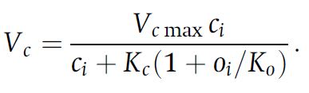
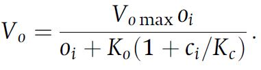
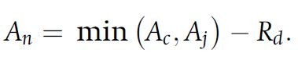
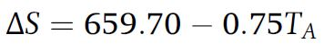
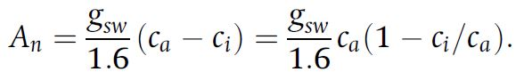
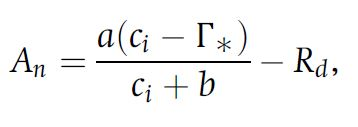

```{r setup, include=FALSE}
knitr::opts_chunk$set(echo = TRUE)
setwd("C:/Users/Mogli/Desktop/Git Hub/canopy-model_new/photosynthesis_stomatalconductance/TermPaperFiles/TheoryFormulas")
```


## Theory

The leaf photosynthesis model can essentially be divided into two interacting components which are modeled individually. These two components are photosynthesis in the form of net assimilation and stomatal conductance as chemical flux in and out of the leaf. All theory, equations and figures are obtained from Bonan (2019) **Chapter 11** and **12**. 

### Photosynthesis


Photosynthesis is calculated using the Farquhar-von Caemmerer-Bernacchi model (FvCB model) that mathematically describes the C3 photosynthesis pathway. 
The foundation for the model is formulated as 


To calculate carboxylation and oxygenation, the Michaelis Menten response functions are used which calculate carboxylation and oxygenation from the maximum rates (**Vcmax/Vomax**), intercellular concentrations (**ci, oi**) and the michaelis menten constants (**Kc and Ko**). 





Since oxygenation leads to loss of carbon, an intercellular carbon concentration exists at which no CO2 is taken up. This 
concentration is called the CO2 compensation point and is calculated by 


Furthermore assimilation is not only limited by the maximum rate of carboxylation but also by the rate at which Ribulose 1,5-bisphosphate (**RuBP**) is regenerating. This depends on light absorption and the electron transport in the photosystems (**Jmax**) which is typically termed product limited assimilation. 
These assimilation types can account for **Vo** if the CO2 compensation point is regarded and are calculated by 


The net assimilation according to the FvCB model therefore can be formulated as 



which is the minimum assimilation out of both carboxylation-limited- (Rubisco limited) and product-limited assimilation.  
To account for different enzyme kinetics at varying temperatures, temperature acclimation has to be incorporated using the Arrhenius function which is normalized to 25°C 


This function can be used in its peaked form to adapt the various parameters of the model (such as Vcmax, Jmax, Kc, Ko, etc.) from 25°C standard values to the appropriate growth temperature. 


The entropy term for the thermal breakdown of biochemical processes can be calculated from temperature by 





### Stomatal Conductance


To calculate intercellular CO2 concentration for photosynthesis it is necessary to know the conductance of the stomata. This can be understood from 


In order for CO2 to diffuse into the cell, a concentration gradient from outside to inside the cell is required. This is a dependency which is formulated in the photosynthetic diffusion equation



which can be rearragend to


Since this is a linear relationship between net assimilation and stomatal conductance, a slope can be calculated and a ratio of intercellular to ambient CO2 concentration is used to calculate stomatal conductance if **ci** is known. The relationship between intercellular CO2 concentration, net assimilation and stomatal conductance can be rewritten to focus on the leaf surface which is done for the Ball Berry model of stomata conductance. 


This model focuses on leaf surface humidity and boundary layer CO2 concentration while aiming to satisfy the interaction between stomatal conductance and net assimilation. This interaction can be mathematically described by solving a set of net assimilation two equations for intercellular CO2 concentration. 
Net assimilation of CO2 is governed by the biochemical demand for CO2, the diffusive supply and a stomatal constraint function. 
The constraint function can be combined with the supply function 


to yield the supply-constraint function


The biochemical demand is calculated as follows, depending on the photosynthesis limiting factor. 



To calculate **ci** dependent on a given leaf temperature, an iterative approach can be taken which uses an initial **ci** value and adapts this value until it satisfies the biochemical demand function as well as the diffusive supply-constraint function. This approach is graphically described in the following figure and is also applied in the model. The calculation is repeated until the old and new **ci** values converge.


