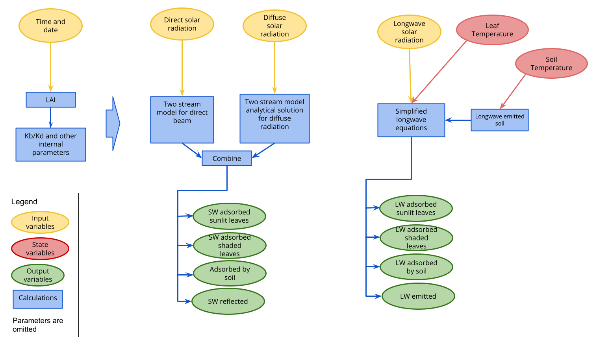

# Model development

```{r, include = F}
source("radiative_transfer/term paper/radiation_utils_test_data.R")
library(FME)
```
Developing model is an important aspect i.e making the model work from all complex equations into simplified version by writing them in code format in R.
Developing equations of parameters with optimization, and developing code for short wave through incoming direct and diffuse equations and dividing longwave also in downward and upward, absorbed with canopy and soil. Such simple division of waves into short and long gives us the absorbed radiation passed towards leaf energy balance model and photosynthesis model.

We have to do some assumption so that the model could be developed like we considered only spherical leaf angle distribution and two stream model case in shortwave and forward scattering in case for longwave radiation.

@bonan_2019 has been used as a reference for the all theory of the model development and its example script as a starting point.



## Parameters


 - Leaf reflectance
 - Leaf transmittance
 - Soil albedo for direct shortwave radiation
 - Soil albedo for diffuse shortwave radiation

 - Leaf longwave emissivity
 - Soil longwave emissivity

 - Canopy clumping coefficient
 - Max LAI (variation over year)

 - Latitude of Hainich
 - Longitude of Hainich

### LAI

The variation of the LAI over the year has been obtained with a simple model (Figure \@ref(fig:laiyear)) that considers a linear increase of LAI during the spring and a similar process during autumn.
During winter the LAI is considered to be $1$, even if there are no leaves, as trunks and branches interact with the radiation.
```{r laiyear, echo = F, fig.cap = "LAI over year"}
days <- seq.Date(as.Date("2020-01-01"), as.Date("2020-12-31"), by=1)
LAI <- pmax(Vectorize(get_day_LAI, "datetime")
            (days, pars$max_LAI, pars$leaf_out, pars$leaf_full, pars$leaf_fall, pars$leaf_fall_complete), pars$min_radiation_PAI)
ggplot() +
  geom_line(aes(x = days, y = LAI)) +
  ylim(c(0, pars$max_LAI)) +
  labs(title = "LAI over the year")
```

## Sensitivity

The sensitivity analysis of the model has been made using the `FME` package, specifically the function `sensFun`.


The sensitivity analysis has been carried out with data from the July 2018 from the Hainich site. The leaf temperature was assumed equal to the air temperature, while the soil temperature is the average of the first 30 cm.


```{r sens-run, cache = T, include = F}
sens_p <- pars[c("rho_leaf", "tau_leaf", "alb_soil_b", "alb_soil_d", "em_leaf", "em_soil")]
sens_model <- sensFun(rad_transf_new_p_1m, sens_p, map=NULL)
```
Table \@ref(tab:model-sens) represents the sensitivity of each parameter after aggregating on all model outputs. There are three aggregation functions that are used by the `FME` paper @fme_2010 :

 - mean
 - L1
 - L2


```{r model-sens, echo=F, warning = F}
sens_sum <- summary(sens_model)
# cbind(par = attr(sens_sum, "row.names"), sens_sum) #little hack because pycharm doesn't show row names properly
knitr::kable(
  sens_sum, booktabs = TRUE,
  digits = 2,
  caption = 'Aggregated model sensitivity.'
)
```

This summary, however, consider both the longwave and shortwave components even if the parameter has no impact on that sub-model. Therefore, the sensitivity has been manually divided and analyzed for each output variable independently.

### Shortwave

```{r, include = F}
sens_sw <- filter_sens(sens_model, vars = c("i_down", "i_up", "ic", "ic_sha", "ic_sun", "ig"),
                       pars = c("rho_leaf", "tau_leaf" ,"alb_soil_b", "alb_soil_d"))
```
For the shortwave (Tables \@ref(tab:sw-sens-mean) \@ref(tab:sw-sens-l1) \@ref(tab:sw-sens-l2)) the leaf reflectance ($\rho$) is the parameter with the highest effect on all output variables.
Leaf transmittance ($\tau$) has reduced influence, while the soil albedo have a very small impact on the model.

```{r sw-sens-mean, echo = F}
knitr::kable(detailed_sens(sens_sw, mean), caption = "Shortwave sensitivity aggregated by mean", digits = 2)
```


```{r sw-sens-l1, echo = F}
knitr::kable(detailed_sens(sens_sw, function(x) mean(abs(x))), caption = "Shortwave sensitivity aggregated by L1", digits = 2)
```

```{r sw-sens-l2, echo = F}
knitr::kable(detailed_sens(sens_sw, function(x) sqrt(mean(x^2))), caption = "Shortwave sensitivity aggregated by L2", digits = 2)
```

### Longwave

```{r, include = F}
sens_lw <- filter_sens(sens_model, vars = c("l_down", "l_up", "lc", "lc_sha", "lc_sun", "lg"),
                       pars = c("em_leaf", "em_soil"))
```
For the longwave (Tables \@ref(tab:lw-sens-mean) \@ref(tab:lw-sens-l1) \@ref(tab:lw-sens-l2)) the parameters are the emissivity of the leaves ($\varepsilon_l$) and the emissivity of the soil ($\varepsilon_g$). The former has a significant impact on all output variables while the latter has a very important influence only on the amount or radiation absorbed by the canopy and emitted by the soil.


```{r lw-sens-mean, echo = F}
knitr::kable(detailed_sens(sens_lw, mean), caption = "Longwave sensitivity aggregated by mean", digits = 2)
```
```{r lw-sens-l1, echo = F}
knitr::kable(detailed_sens(sens_lw, function(x) mean(abs(x))), caption = "Longwave sensitivity aggregated by L1", digits = 2)
```
```{r lw-sens-l2,echo = F}
knitr::kable(detailed_sens(sens_lw, function(x) sqrt(mean(x^2))), caption = "Longwave sensitivity aggregated by L2", digits = 2)
```

## Model calibration

The sensitvity analysis allows to understand for which parameters the calibration is important.

The observed data at Hainich during July 2018 is used for the calibration.

## Shortwave

The shortwave is calibrated on two parameters: `rho_leaf` and `tau_leaf`.

The obtained values \@ref(tab:sw-par-fit) are similar of the initial estimates of $0.40$ and $0.05$ respectively.

```{r, echo = F}
cal_p_sw <- c(rho_leaf = 0.4, tau_leaf = 0.1)
cal_p_sw_lower <- c(rho_leaf = 0.38, tau_leaf = 0.05 )
cal_p_sw_upper <- c(rho_leaf = 0.42, tau_leaf = 0.2)

model_cost_sw <- function (params){
  out <- rad_transf_new_p_1m(params)
  return(out$i_up - fluxes$sw_out)
}
```

```{r sw-fit, cache = T, include = F}
mfit_sw <- modFit(model_cost_sw, cal_p_sw, cal_p_sw_lower, cal_p_sw_upper)
```

```{r sw-par-fit, error = T, warning = F, echo = F}
knitr::kable(
  summary(mfit_sw)$par[,1],
  caption = "Shortwave parameters after calibration"
)
```

### Longwave

For the longwave no calibration has been made because the real leaf temperature was not available therefore the calibration would have resulted with not realistic parameter values.
